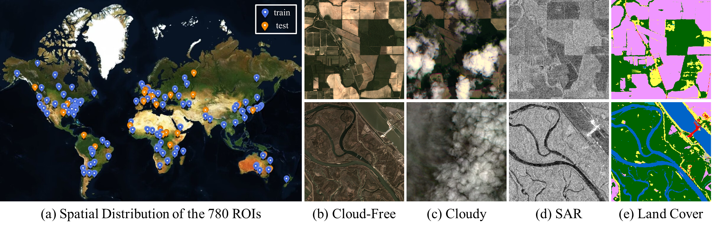

# Multimodal and Multiresolution Data Fusion for High-Resolution Cloud Removal: A Novel Baseline and Benchmark
This repository contains the codes for the paper "Multimodal and Multiresolution Data Fusion for High-Resolution Cloud Removal: A Novel Baseline and Benchmark" 

If you use the codes for your research, please cite us accordingly:

```
@ARTICLE{10354035,
  author={Xu, Fang and Shi, Yilei and Ebel, Patrick and Yang, Wen and Zhu, Xiao Xiang},
  journal={IEEE Transactions on Geoscience and Remote Sensing}, 
  title={Multimodal and Multiresolution Data Fusion for High-Resolution Cloud Removal: A Novel Baseline and Benchmark}, 
  year={2024},
  volume={62},
  number={},
  pages={1-15},
  keywords={Clouds;Optical imaging;Remote sensing;Optical sensors;Image reconstruction;Earth;Spatial resolution;Cloud removal (CR);data fusion;multimodal;multiresolution},
  doi={10.1109/TGRS.2023.3337845}}
```

M3R-CR is the first public dataset for cloud removal to feature globally sampled high-resolution optical observations, paired with radar measurements and pixel-level land-cover annotations. With this dataset, we consider the problem of cloud removal in high-resolution optical remote-sensing imagery by integrating multimodal and multiresolution information.


The major characteristics of this dataset are summarized as follows:

- **Filling High-Resolution Dataset Gap**. Unlike existing publicly available CR datasets, which are primarily built on medium-resolution Landsat-8 or Sentinel-2 data, our dataset is constructed using high-resolution PlanetScope data. As a result, it fulfills the requirement of high-resolution CR datasets. It provides the opportunity to push the frontier of current CR models on recovering clear edge and rich texture
detail of high-resolution remote-sensing imagery
- **Integrating Multimodal Multiresolution Data**. The inclusion of Sentinel-1 SAR data can provide auxiliary information to promote CR performance. Compared with the existing CR datasets like SEN12MS-CR, which mostly explore the fusion of Sentinel-1 SAR data and Sentinel-2 optical data with the same resolution of 10 m, our M3R-CR dataset helps to understand a more practical yet more complex problem, that is, MMRF-CR.  
- **Inclusion of Land-Cover Information**. The inclusion of land cover can disentangle the performance of CR methods over different land-cover types, on the one hand, and encourages to design of a pixel-level classification task to evaluate the power of the CR method in generating semantically meaningful structures, on the other hand.


## Dataset

The M3R-CR dataset contains 780 different AOIs across the globe from all meteorological seasons, each of which contains a quartet of orthorectified, geo-referenced cloudy and cloud-free [**PlanetScope images**](https://developers.planet.com/docs/apis/data/), as well as the corresponding [**Sentinel-1 SAR image**](https://sentinels.copernicus.eu/web/sentinel/missions/sentinel-1) and [**WorldCover land cover map**](https://worldcover2020.esa.int/). The complete dataset will be released soon (If you want to use the complete dataset now, please register at https://www.planet.com/markets/education-and-research/, and send an email to xufang@whu.edu.cn). The dataset is only for acadamic research.

## Data Loading and Preprocessing

You can load and preprocess images via "dataloader.py" in "./M3M-CR":

```
python dataloader.py
```

## Baselines

- [x] [DSen-CR](https://www.sciencedirect.com/science/article/pii/S0924271620301398)
- [x] [GLF-CR](https://www.sciencedirect.com/science/article/pii/S0924271622002064)

Continually Updating

## Align-CR

This code has been tested with CUDA 11.8 and Python 3.8.

```
conda create -n pt200cu118 python=3.8

pip install torch==2.0.0+cu118 torchvision==0.15.1+cu118 torchaudio==2.0.1 --index-url https://download.pytorch.org/whl/cu118

git clone https://github.com/XPixelGroup/BasicSR.git

cd BasicSR

CUDA_HOME=/usr/local/cuda-11.8/ \
CUDNN_INCLUDE_DIR=/usr/local/cuda-11.8/ \
CUDNN_LIB_DIR=/usr/local/cuda-11.8/ \
BASICSR_EXT=True pip install basicsr

pip install rasterio timm 
```
This code is based on the codes available in the [BasicSR](https://github.com/XPixelGroup/BasicSR) repo. I am grateful to the authors for making the original source code available.
