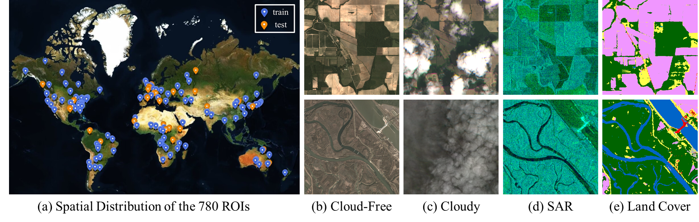

# Planet-CR: A Multi-Modal and Multi-Resolution Dataset for Cloud Removal in High Resolution Optical Remote Sensing Imagery

Planet-CR is the first public dataset for cloud removal to feature globally sampled high resolution optical observations, in combination with paired radar measurements as well as pixel-level land cover annotations. With this dataset, we consider the problem of cloud removal in high resolution optical remote sensing imagery by integrating multi-modal and multi-resolution information. 



The major characteristics of this dataset are summarized as follows:

- **High Spatial Resolution**. The Planet-CR dataset releases the cloudy and cloud-free PlanetScope data with a spatial resolution of 3m. Compared to existing publicly available cloud removal datasets which are mostly built on medium-resolution Landsat-8 data or Sentinel-2 data, our dataset redeems the current lack of cloud removal datasets with high resolution, and advances the task of high-resolution cloud removal that is still under-explored.
- **Multi-Modal and Multi-Resolution Fusion**. The inclusion of Sentinel-1 SAR data can provide auxiliary information to promote cloud removal of PlanetScope data. Compared with the existing cloud removal datasets like SEN12MS-CR, which mostly explore the fusion of Sentinel-1 SAR data and Sentinel-2 optical data with the same resolution of 10m, our Planet-CR dataset helps to understand a more practical yet more complex problem, i.e., multi-modal and multi-resolution data fusion based cloud removal.  
- **Information on Land Cover**. The inclusion of land cover can disentangle the performance of cloud removal methods over different land cover types on the one hand, and encourages to design a pixel-level classification task to evaluate the power of the cloud removal method in generating semantically meaningful structures on the other.


## Dataset

The Planet-CR dataset contains 780 different AOIs across the globe from all meteorological seasons, each of which contains a quartet of orthorectified, geo-referenced cloudy and cloud-free  [**PlanetScope images**](https://developers.planet.com/docs/apis/data/), as well as the corresponding  [**Sentinel-1 SAR image**](https://sentinels.copernicus.eu/web/sentinel/missions/sentinel-1) and  [**WorldCover land cover map**](https://worldcover2020.esa.int/). The complete dataset will be released soon.

## Data Loading and Preprocessing

You can load and preprocess images via "dataloader.py" in "./Planet-CR":

```
python dataloader.py
```

## Baselines

- [x] [DSen-CR](https://www.sciencedirect.com/science/article/pii/S0924271620301398)
- [x] [GLF-CR](https://www.sciencedirect.com/science/article/pii/S0924271622002064)

Continually Updating

